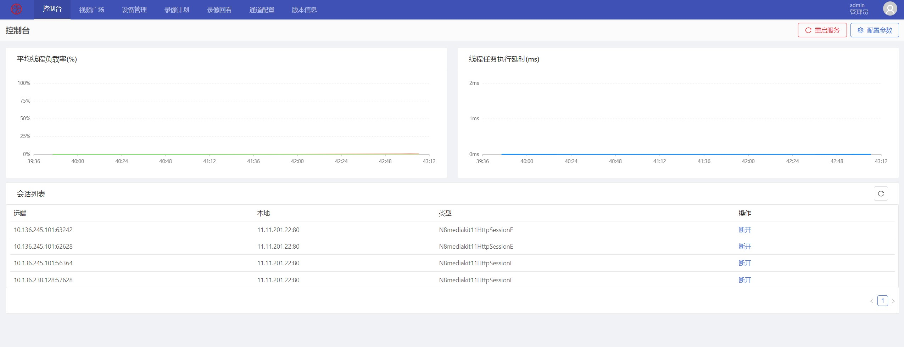
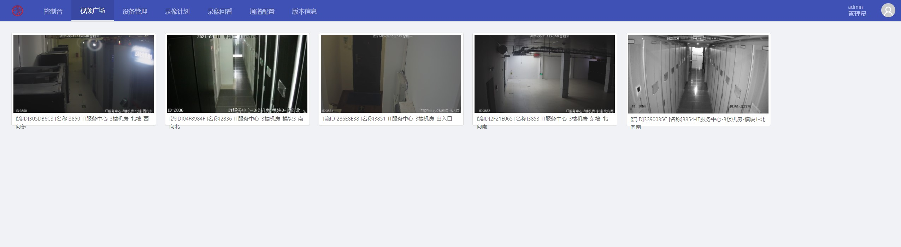
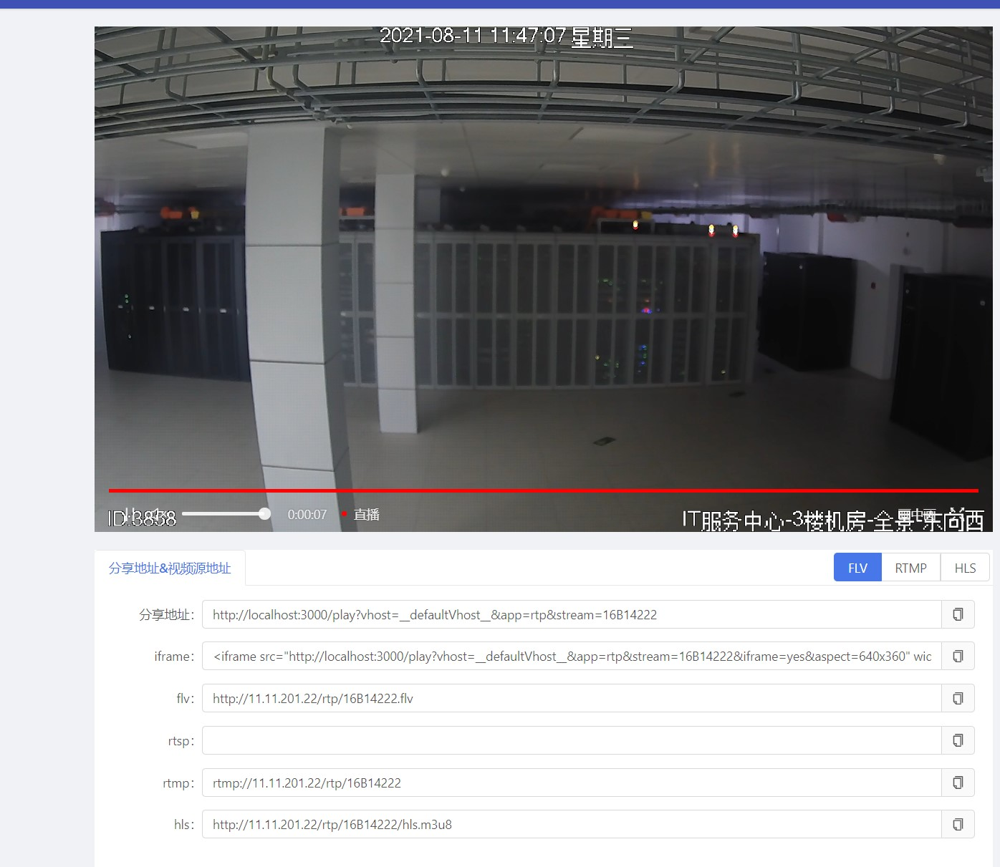
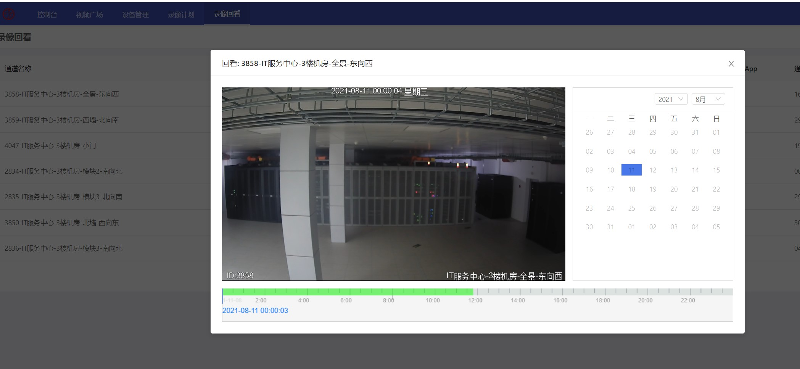

<div align="center"><h1 align="center">AKStreamNVR</a></h1></div>
<div align="center"><h3 align="center">AKStreamNVR，开箱即用</h3></div>

### 概述

* 基于 React+And 的前端技术，开箱即用。
* 代码简洁、易扩展，让开发更简单、更通用、更流行！

```
如果对您有帮助，点击右上角⭐Star⭐关注 ，感谢支持开源！
```
### 在线Demo演示
演示地址：http://akstream.govfun.com:10059/

### 快速启动

（1）修改 src/config/apiconfig.js文件中的secret和AccessKey（secret为ZLMediaKit配置文件中的secret，AccessKey为AKStreamWeb配置文件的AccessKey）
（2）修改 public/env-config.js 文件，REACT_APP_API_HOST为ZLMediaKit服务地址，AKSTREAM_WEB_API为AKStreamWeb服务地址
（3）下载安装 npm或yarn（最新版）
（4）还原包 npm install（yarn install）
（5）启动 npm run start （yarn run start）

* 浏览器访问：`http://localhost:3000` （默认前端端口为：3000）

### 效果图








### 详细功能

1. 控制台
2. 视频广场
3. 设备管理
4. 录像计划
5. 录像回放
6. 视频推流
7. 视频拉流
8. 视频录制

### 补充说明

* 有问题讨论的小伙伴可加群一起学习讨论。 QQ群【870526956】

### 特别鸣谢
- 👉 ZLMediaKit：[https://github.com/ZLMediaKit/ZLMediaKit](https://github.com/ZLMediaKit/ZLMediaKit)
- 👉 AKStream：[https://github.com/chatop2020/AKStream](https://github.com/chatop2020/AKStream)

如果对您有帮助，您可以点右上角 💘Star💘支持一下，这样我们才有持续下去的动力，谢谢！！！

